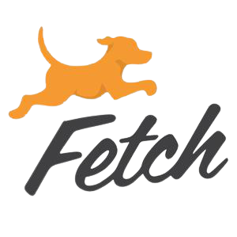
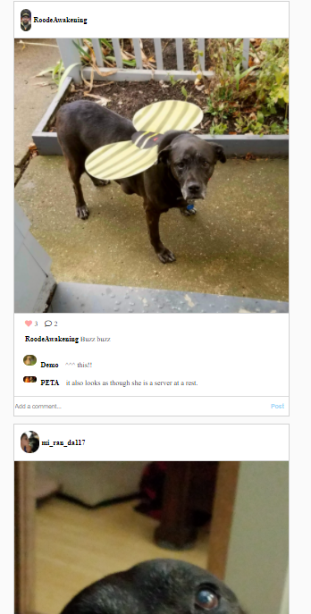
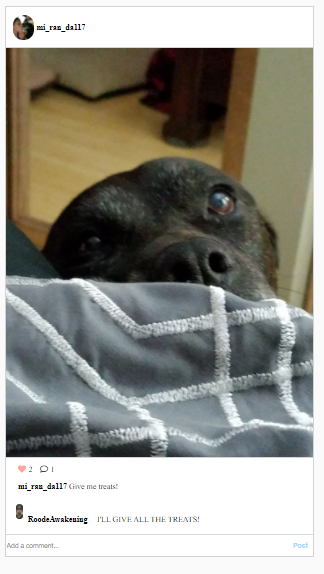

<!--
*** Thanks for checking out the Best-README-Template. If you have a suggestion
*** that would make this better, please fork the repo and create a pull request
*** or simply open an issue with the tag "enhancement".
*** Thanks again! Now go create something AMAZING! :D
***
***
***
*** To avoid retyping too much info. Do a search and replace for the following:
*** RoodeAwakening, Fetch, twitter_handle, derek.i.roode@gmail.com, Fetch, project_description
-->


<!-- PROJECT SHIELDS -->
<!--
*** I'm using markdown "reference style" links for readability.
*** Reference links are enclosed in brackets [ ] instead of parentheses ( ).
*** See the bottom of this document for the declaration of the reference variables
*** for contributors-url, forks-url, etc. This is an optional, concise syntax you may use.
*** https://www.markdownguide.org/basic-syntax/#reference-style-links
-->
[![Contributors][contributors-shield]][contributors-url]
[![Forks][forks-shield]][forks-url]
[![Stargazers][stars-shield]][stars-url]
[![Issues][issues-shield]][issues-url]
[![MIT License][license-shield]][license-url]
[![LinkedIn][linkedin-shield]][linkedin-url]


<!-- PROJECT LOGO -->
<br />
<p align="center">
  <a href="https://github.com/RoodeAwakening/Fetch">
    
  </a>

  <h3 align="center">Fetch</h3>

  <p align="center">
    Like instigram but its only for dogs!
    <br />
    <a href="https://github.com/RoodeAwakening/Fetch/wiki"><strong>Explore the docs »</strong></a>
    <br />
    <br />
    <a href="https://github.com/RoodeAwakening/Fetch">View Demo</a>
    ·
    <a href="https://github.com/RoodeAwakening/Fetch/issues">Report Bug</a>
    ·
    <a href="https://github.com/RoodeAwakening/Fetch/issues">Request Feature</a>
  </p>
</p>


<!-- TABLE OF CONTENTS -->
<details open="open">
  <summary><h2 style="display: inline-block">Table of Contents</h2></summary>
  <ol>
    <li>
      <a href="#about-the-project">About The Project</a>
      <ul>
        <li><a href="#built-with">Built With</a></li>
      </ul>
    </li>
    <li>
      <a href="#getting-started">Getting Started</a>
      <ul>
        <li><a href="#prerequisites">Prerequisites</a></li>
        <li><a href="#installation">Installation</a></li>
      </ul>
    </li>
    <li><a href="#usage">Usage</a></li>
    <li><a href="#roadmap">Roadmap</a></li>
    <li><a href="#contributing">Contributing</a></li>
    <li><a href="#license">License</a></li>
    <li><a href="#contact">Contact</a></li>
    <li><a href="#acknowledgements">Acknowledgements</a></li>
  </ol>
</details>


<!-- ABOUT THE PROJECT -->
## About The Project

[![Fetch][product-screenshot]](https://example.com)

We have a dream and that dream is to have a site that you can go to at any time day or night and look at thousands of pictures of dogs!!! Who doesn't love that idea! With our top of the line image recognition software we can verify that every picture does indeed contain an image of a dog.

### Built With


* [React](https://reactjs.org/docs/hooks-effect.html)
* [Python](https://www.python.org/)
* [Flask](https://flask.palletsprojects.com/en/1.1.x/)
* [SQLAlchemy](https://www.sqlalchemy.org/)
* [Redux](https://redux.js.org/)


<!-- GETTING STARTED -->
## Getting Started

To get a local copy up and running follow these simple steps.

### Prerequisites

This is an example of how to list things you need to use the software and how to install them.
* npm
  ```sh
  npm install npm@latest -g
  ```

### Installation

1. Clone the repo
   ```sh
   git clone https://github.com/RoodeAwakening/Fetch.git
   ```
2. Install NPM packages
   ```sh
   pipenv install
   pipenv install python-dotenv
   pip install google-cloud-vision
   npm install
   ```


<!-- USAGE EXAMPLES -->
## Usage

We designed this app to be a pet friendly place. Making sure all the photos of your dog can be seen by the world! By implemeniting our dog verification system we can make sure that your seeing nothing but dogs!

### An easy to use login.


### A dog filled feed page.



### Check out a post.



_For more examples, please refer to the [Documentation](https://github.com/RoodeAwakening/Fetch/wiki)_


<!-- ROADMAP -->
## Roadmap

See the [open issues](https://github.com/RoodeAwakening/Fetch/issues) for a list of proposed features (and known issues).


<!-- CONTRIBUTING -->
## Contributing

Contributions are what make the open source community such an amazing place to be learn, inspire, and create. Any contributions you make are **greatly appreciated**.

1. Fork the Project
2. Create your Feature Branch (`git checkout -b feature/AmazingFeature`)
3. Commit your Changes (`git commit -m 'Add some AmazingFeature'`)
4. Push to the Branch (`git push origin feature/AmazingFeature`)
5. Open a Pull Request


<!-- LICENSE -->
## License

Distributed under the MIT License. See `LICENSE` for more information.


<!-- CONTACT -->
## Contact

* Derek Roode - derek.i.roode@gmail.com
* Justin Payne - justinppayne@gmail.com
* Bryan Burns - Na@na.com

Project Link: [https://github.com/RoodeAwakening/Fetch](https://github.com/RoodeAwakening/Fetch)


<!-- ACKNOWLEDGEMENTS -->
## Acknowledgements

* []()
* []()
* []()


<!-- MARKDOWN LINKS & IMAGES -->
<!-- https://www.markdownguide.org/basic-syntax/#reference-style-links -->
[contributors-shield]: https://img.shields.io/github/contributors/RoodeAwakening/Fetch.svg?style=for-the-badge
[contributors-url]: https://github.com/RoodeAwakening/Fetch/graphs/contributors
[forks-shield]: https://img.shields.io/github/forks/RoodeAwakening/Fetch.svg?style=for-the-badge
[forks-url]: https://github.com/RoodeAwakening/Fetch/network/members
[stars-shield]: https://img.shields.io/github/stars/RoodeAwakening/Fetch.svg?style=for-the-badge
[stars-url]: https://github.com/RoodeAwakening/Fetch/stargazers
[issues-shield]: https://img.shields.io/github/issues/RoodeAwakening/Fetch.svg?style=for-the-badge
[issues-url]: https://github.com/RoodeAwakening/Fetch/issues
[license-shield]: https://img.shields.io/github/license/RoodeAwakening/Fetch.svg?style=for-the-badge
[license-url]: https://github.com/RoodeAwakening/Fetch/blob/master/LICENSE.txt
[linkedin-shield]: https://img.shields.io/badge/-LinkedIn-black.svg?style=for-the-badge&logo=linkedin&colorB=555
[linkedin-url]: https://www.linkedin.com/in/derek-roode-9014a796/
