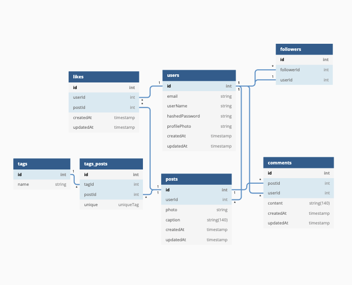

# `Users`

| Column Name      | Data Type | Details               | Description           |
| ---------------- | --------- | --------------------- | --------------------- |
| `id`             | integer   | not null, primary key | Users unique id       |
| `email`          | string    | not null, unique      | Users email           |
| `userName`       | string    | not null, unique      | Users username        |
| `hashedPassword` | string    | not null              | Users hashed password |
| `profilePhoto`   | string    | not null              | Users profile photo   |
| `createdAt`      | datetime  | not null              | timestamp             |
| `updatedAt`      | datetime  | not null              | timestamp             |

# `Followers`

| Column Name  | Data Type | Details               | Description       |
| ------------ | --------- | --------------------- | ----------------- |
| `id`         | integer   | not null, primary key | follower table id |
| `followerId` | integer   | not null              | id of a follower  |
| `userId`     | integer   | not null              | Users unique id   |
| `unique`     | uniqueTag | not null              | unique identifier |

# `Likes`

| Column Name | Data Type | Details               | Description     |
| ----------- | --------- | --------------------- | --------------- |
| `id`        | integer   | not null, primary key | Like unique id  |
| `userId`    | integer   | not null              | Users unique id |
| `postId`    | integer   | not null              | post unique id  |
| `createdAt` | datetime  | not null              | timestamp       |
| `updatedAt` | datetime  | not null              | timestamp       |

# `Tags`

| Column Name | Data Type | Details               | Description   |
| ----------- | --------- | --------------------- | ------------- |
| `id`        | integer   | not null, primary key | Tag unique id |
| `name`      | string    | not null              | hashtag       |

# `Tags_posts`

| Column Name | Data Type | Details               | Description               |
| ----------- | --------- | --------------------- | ------------------------- |
| `id`        | integer   | not null, primary key | Tag on post unique id     |
| `tagId`     | integer   | not null              | hashtag on post unique id |
| `postid`    | integer   | not null              | post id referencing post  |
| `unique`    | uniqueTag | not null              | unique tag identifier     |

# `Posts`

| Column Name | Data Type   | Details               | Description      |
| ----------- | ----------- | --------------------- | ---------------- |
| `id`        | integer     | not null, primary key | post unique id   |
| `userId`    | integer     | not null              | Users unique id  |
| `photo`     | string      | not null              | users photo      |
| `caption`   | string(140) |                       | caption on photo |
| `createdAt` | datetime    | not null              | timestamp        |
| `updatedAt` | datetime    | not null              | timestamp        |

# `Comments`

| Column Name | Data Type   | Details               | Description       |
| ----------- | ----------- | --------------------- | ----------------- |
| `id`        | integer     | not null, primary key | Comment unique id |
| `postId`    | integer     | not null              | Post unique id    |
| `userId`    | integer     | not null              | Users unique id   |
| `content`   | string(140) | not null              | content           |
| `createdAt` | datetime    | not null              | timestamp         |
| `updatedAt` | datetime    | not null              | timestamp         |

